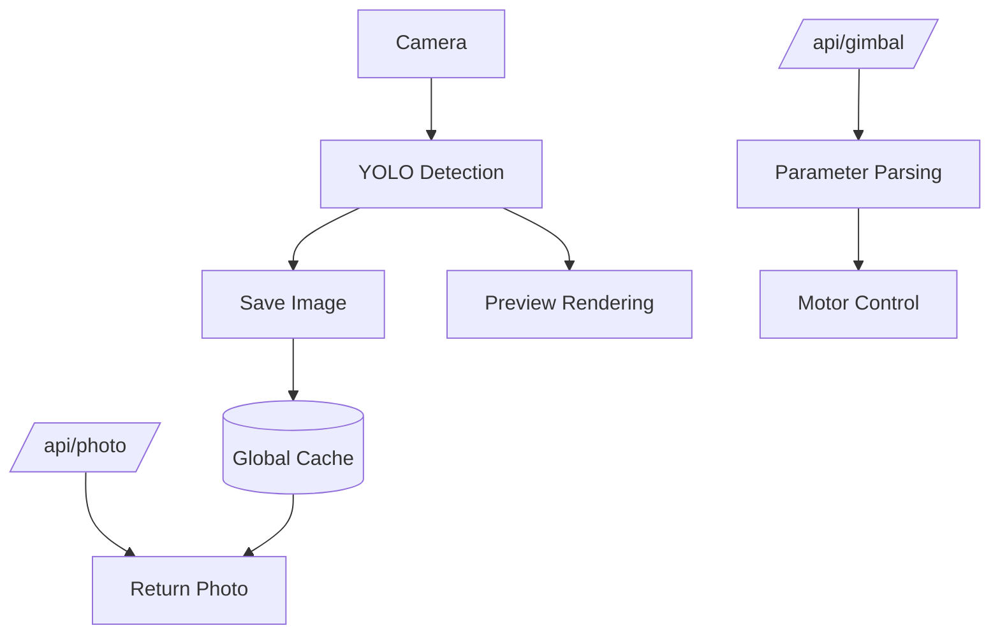

# reCamera_Gimbal-OpenClaw

> Use OpenClaw to control the motor, camera, LED, microphone, and speaker of a reCamera Gimbal.

Wiki Link: https://wiki.seeedstudio.com/use_cpenclaw_to_control_the_recamera_gimbal/

> [!NOTE]
> The `cpenclaw` in the wiki URL above is a typo on Seeed's side, but it is the **real, working** address — do not "correct" it to `openclaw`, which 404s.

## What This Is

This project provides an **OpenClaw Skill + Node-RED flow** for controlling a **reCamera Gimbal edge AI camera**.

It enables:

- Motor (yaw/pitch) control via HTTP API
- Image capture and retrieval
- LED control
- Audio recording and playback
- Vision-based interaction via OpenClaw

**Role in OpenClaw:** Skill (with external Node-RED runtime integration)

### Transport at a glance

Two different transports are used, and this matters for setup and debugging:

| Capability | Transport | Needs SSH key? |
| ---------- | --------- | -------------- |
| Photo capture (`/api/photo`) | HTTP to Node-RED | No |
| Gimbal control (`/api/gimbal`) | HTTP to Node-RED | No |
| LED on/off | SSH + `sudo` on device | **Yes** |
| Audio record/play | SSH + `sudo` on device | **Yes** |

So if photo/gimbal work but LED/audio hang, it is almost always an SSH-key problem, not a network problem. See [SSH Key Setup](#ssh-key-setup-required-for-ledaudio).

-----

## Prerequisites

> [!IMPORTANT]
> You need the following components (derived from project files):

- A **reCamera Gimbal device** (RISC-V edge AI camera)
- **Node-RED** running on the device (port `1880`)
- **OpenClaw** environment with `Exec` tool enabled
- Network access to the device (local IP like `192.168.16.xxx`, or the camera hotspot default `192.168.16.1`)
- A host to run the skill scripts: **Windows** (PowerShell + `ssh.exe`) or **Linux** (Bash + OpenSSH client + `curl`)

-----

## Quick Start

### 1. Import Node-RED Flow

Import the provided file into Node-RED:

```
openclaw_V2.json
```

This creates two HTTP endpoints:

- Control gimbal: `http://<DEVICE_IP>:1880/api/gimbal?yaw=90&pitch=45`
- Capture photo: `http://<DEVICE_IP>:1880/api/photo`

-----

### 2. Install Skill into OpenClaw

Copy the skill folder `recamera-gimbal/` into your OpenClaw workspace:

```bash
# Linux
~/.openclaw/workspace/skills/recamera-gimbal/

# Windows
C:\Users\<you>\.openclaw\workspace\skills\recamera-gimbal\
```

-----

### 3. Configure openclaw.json

The `openclaw.json` file lives in your OpenClaw installation directory and holds the app configuration. Add an entry for this skill so OpenClaw exports the device IP and password to the scripts.

> [!NOTE]
> A ready-to-edit fragment with placeholders is provided in [`openclaw.example.json`](openclaw.example.json). Copy the relevant block into your real `openclaw.json` and fill in your values.

#### Minimal config (skill in the default workspace folder)

If you copied the skill into the **default** workspace skills folder (`~/.openclaw/workspace/skills/`), OpenClaw auto-discovers it — you do **not** need `skills.load.extraDirs`. You only need the per-skill `env`:

```json
"skills": {
  "entries": {
    "recamera-gimbal": {
      "enabled": true,
      "env": {
        "RECAMERA_IP": "192.168.16.1",
        "RECAMERA_PASS": "recamera"
      }
    }
  }
}
```

#### Custom skills directory (optional)

Only if your skills live somewhere **other** than the default workspace folder, add `skills.load.extraDirs` pointing at that directory. Use the path format for your host — Windows: `"C:\\Users\\<you>\\.openclaw\\workspace\\skills"`, Linux: `"/home/<you>/.openclaw/workspace/skills"`:

```json
"skills": {
  "load": {
    "extraDirs": [
      "C:\\Users\\<you>\\.openclaw\\workspace\\skills"
    ]
  },
  "entries": {
    "recamera-gimbal": {
      "enabled": true,
      "env": {
        "RECAMERA_IP": "192.168.16.1",
        "RECAMERA_PASS": "recamera"
      }
    }
  }
}
```

> [!NOTE]
> - Replace `"192.168.16.1"` with the actual IP of your reCamera Gimbal.
> - Replace `"recamera"` with the actual **sudo** password of your device.
> - The `RECAMERA_IP` / `RECAMERA_PASS` values are exported to the scripts as environment variables. The scripts read those first and only fall back to built-in defaults, so `openclaw.json` is the single source of truth — you do **not** need to edit the scripts.

> [!TIP]
> On Linux, make the shell scripts executable once after copying them:
>
> ```bash
> chmod +x ~/.openclaw/workspace/skills/recamera-gimbal/scripts/*.sh
> ```
>
> SSH login to the device uses key-based auth — see [SSH Key Setup](#ssh-key-setup-required-for-ledaudio) below. `RECAMERA_PASS` is only the password handed to `sudo -S` on the device (for LED/audio control), not the SSH login password.

-----

### SSH Key Setup (required for LED/audio)

The LED and audio scripts log in to the device over SSH **using a key** (they never pass a login password — the value in `RECAMERA_PASS` is only piped to `sudo -S` on the device). So before they work you must install your public key on the camera **once**.

> [!NOTE]
> The device ships with login user `recamera` and the default password `recamera` (you are prompted to change it on first login). That password is what authorizes the one-time key import below; after that, logins are passwordless.

**Generate a key** (skip if you already have one at `~/.ssh/id_ed25519`):

```bash
ssh-keygen -t ed25519 -C "openclaw-recamera"
```

**Install the public key on the device** — pick whichever fits your host:

```bash
# Linux / macOS / Git Bash — easiest
ssh-copy-id recamera@192.168.16.1
```

```powershell
# Windows PowerShell (no ssh-copy-id) — append the key to the device's authorized_keys
$pub = Get-Content "$env:USERPROFILE\.ssh\id_ed25519.pub"
ssh recamera@192.168.16.1 "mkdir -p ~/.ssh && echo '$pub' >> ~/.ssh/authorized_keys && chmod 600 ~/.ssh/authorized_keys"
```

You can also paste the public key into the reCamera web dashboard if it exposes an "SSH keys" / "authorized keys" field.

> [!TIP]
> This is a great task to hand to the OpenClaw agent itself: ask it to *"generate an SSH keypair and install the public key on the reCamera at 192.168.16.1 (user recamera)"*. With `RECAMERA_PASS` present in the skill environment, the agent can run the bootstrap described in `SKILL.md` ("SSH Bootstrap For LED/Audio"), entering the password once. After that the LED/audio skills work hands-free. (Set up this way with an OpenClaw agent and it works without issues.)

**Verify passwordless login** (this exact test is also what the scripts rely on):

```bash
ssh -o BatchMode=yes -o ConnectTimeout=5 recamera@192.168.16.1 "echo ok"   # prints "ok", no password prompt
```

`BatchMode=yes` makes the test fail fast instead of hanging on a password prompt if the key is not yet installed.

-----

### 4. Verify

Photo and gimbal go over **HTTP** (no SSH needed) — test them first, they are the simplest signal that the device and Node-RED flow are alive:

```bash
# Move gimbal (real command, run it as-is)
curl -fsS "http://<DEVICE_IP>:1880/api/gimbal?yaw=120&pitch=90"

# Minimal photo smoke test: fetch a frame and confirm it is a real JPEG
curl -fsS -H "Cache-Control: no-cache" "http://<DEVICE_IP>:1880/api/photo" -o latest_photo.jpg && file latest_photo.jpg
```

Expected:

- Gimbal physically moves.
- `latest_photo.jpg` is written and `file` reports something like `JPEG image data, ... 1280x720` (resolution depends on the model/flow).

Only after HTTP works should you test the SSH-based features:

```bash
# LED (needs the SSH key from the step above)
bash recamera-gimbal/scripts/control_led.sh on
```

If LED/audio hang here while photo/gimbal worked, go to [Troubleshooting](#troubleshooting) → "LED/audio command hangs".

-----

## Configuration

### HTTP API Parameters

From Node-RED flow:

| Field | Type   | Default | Range   |
| ----- | ------ | ------- | ------- |
| yaw   | number | 180     | 1 – 345 |
| pitch | number | 90      | 1 – 175 |

Example:

```http
/api/gimbal?yaw=120&pitch=90
```

-----

### Skill Script Paths

Each script ships in two flavors — `.ps1` for a Windows host and `.sh` for a Linux host:

```powershell
# LED control (Windows)
scripts/control_led.ps1 -Action on|off

# Photo capture (via HTTP)
curl.exe -fsS -H "Cache-Control: no-cache" "http://<DEVICE_IP>:1880/api/photo" -o latest_photo.jpg
```

```bash
# LED control (Linux)
bash scripts/control_led.sh on|off

# Audio (Linux): record then play back
bash scripts/record_audio.sh 5
bash scripts/play_audio.sh

# Photo capture (via HTTP)
curl -fsS -H "Cache-Control: no-cache" "http://<DEVICE_IP>:1880/api/photo" -o latest_photo.jpg
```

> [!NOTE]
> `control_led_v2.{ps1,sh}` is a **developer fallback** that copies a temp script to the device with `scp` and runs it there, instead of sending an inline command. Use it only if inline `sudo -S` over SSH misbehaves on your firmware. For normal use, `control_led` is the one to call (and the only LED script referenced by `SKILL.md`).

-----

## Security

- **Never commit a real `RECAMERA_PASS`.** Keep secrets in your own `openclaw.json`, which is not part of this repo.
- The defaults in the scripts (`192.168.16.1`, `recamera`) are the **public factory defaults** for the camera hotspot, used only as a fallback. Treat them as placeholders, not as a working credential to copy elsewhere.
- Don't paste a private LAN IP or a changed password into examples, issues, or commits — use placeholders like `<DEVICE_IP>` / `<YOUR_PASSWORD>`.
- The `env` block in `openclaw.json` is the intended place for your real values; see [`openclaw.example.json`](openclaw.example.json).

-----

## How It Works



### Flow Summary

- Camera captures frames
- YOLO model processes detections
- Latest image stored globally
- HTTP endpoints expose motor control and image retrieval

-----

## Features

- **Gimbal Control**: Control yaw and pitch via HTTP API.
- **Live Image Capture**: Retrieve latest frame as JPEG.
- **Vision Integration**: YOLO-based object detection pipeline.
- **LED Control**: Turn light on/off via PowerShell (`.ps1`) or shell (`.sh`) scripts over SSH.
- **Audio I/O**: Record and play audio via scripts.

-----

## Onboarding

From `SKILL.md`:

| Capability     | Trigger                       | Action                              |
| -------------- | ----------------------------- | ----------------------------------- |
| Vision capture | "look", "see", "take photo"   | Call `/api/photo`, analyze image    |
| Gimbal control | directional commands          | Call `/api/gimbal`                  |
| LED control    | "turn on/off light"           | Run `control_led` script (.ps1/.sh) |
| Audio          | "record/play"                 | Run audio script                    |

-----

## Policy

> [!IMPORTANT]
> These rules are an **agent runtime policy** — they constrain the executing OpenClaw agent at runtime. They are **not** a restriction on maintainers (e.g. Claude Code or you): maintaining this repo necessarily means reading and editing the scripts.

From `SKILL.md` (runtime agent):

| Rule                | Description                                                  |
| ------------------- | ------------------------------------------------------------ |
| No file inspection  | The runtime agent must not read/edit `scripts/`              |
| Exec only           | Use only the predefined commands (plus the SSH bootstrap)    |
| Fixed output format | Must return the image in the strict markdown format          |

-----

## Troubleshooting

**Gimbal does not move**

- Check Node-RED is running on port `1880`
- Verify device IP
- Ensure CAN/motor nodes are connected

**No image returned**

- Ensure model node has debug enabled
- Check global variable `latest_image` is set

**LED/audio command hangs with no output**

- This is the classic symptom: the script is blocked on an SSH prompt (host key, password, or `sudo`), waiting for input that never comes.
- Test passwordless login first — this is safe and returns immediately:

  ```bash
  ssh -o BatchMode=yes -o ConnectTimeout=5 recamera@<DEVICE_IP> "echo ok"
  ```

  - Prints `ok` → SSH is fine; the problem is elsewhere.
  - `Permission denied (publickey)` → your key is not installed; do the [SSH Key Setup](#ssh-key-setup-required-for-ledaudio).
  - Hangs / times out → host unreachable, or host-key prompt; check the IP and network.
- The bundled scripts pass `-o BatchMode=yes -o ConnectTimeout=5`, so they now **fail fast** instead of hanging — but a stale `~/.ssh/known_hosts` entry can still block them; remove it with `ssh-keygen -R <DEVICE_IP>`.

**PowerShell scripts fail (Windows)**

- Run with: `-ExecutionPolicy Bypass`

**Shell scripts fail (Linux)**

- Make them executable: `chmod +x scripts/*.sh`
- LED/audio commands need passwordless SSH login to the device — see [SSH Key Setup](#ssh-key-setup-required-for-ledaudio)

**HTTP API not reachable**

- Check firewall/network
- Confirm Node-RED flow is deployed

-----

## Changelog

Current release: **2.2** (HanJammer fork of Seeed's `1.2`). 2.0 brought cross-platform Windows + Linux scripts, English-only docs, env-driven config, SSH-key setup, and bug fixes; 2.1 hardened it from real agent testing (SSH bootstrap/self-repair, fail-fast SSH timeouts, smoke test, security & config-hygiene docs); 2.2 keeps the agent's workspace clean by writing camera output to a scratch directory instead of the workspace root. See [CHANGELOG.md](CHANGELOG.md) for the full list.

-----

## Links

- OpenClaw Skill Spec: [https://agentskills.io/specification#allowed-tools-field](https://agentskills.io/specification#allowed-tools-field)

-----
