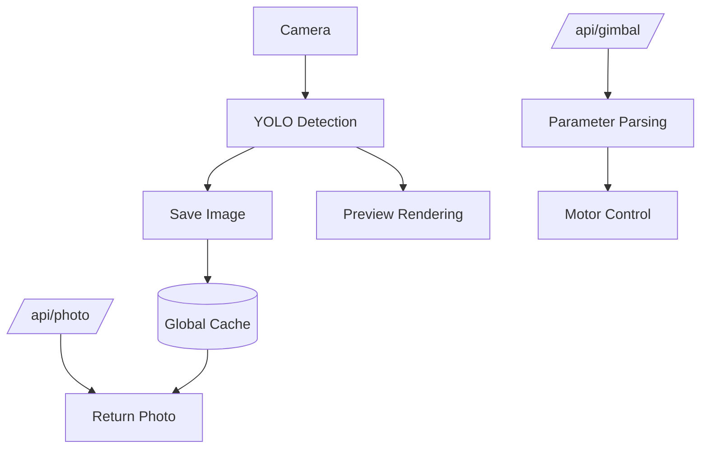

# reCamera_Gimbal-OpenClaw

> Use OpenClaw to control the motor, camera, LED, microphone, and speaker of a reCamera Gimbal.

Wiki Link:https://wiki.seeedstudio.com/use_cpenclaw_to_control_the_recamera_gimbal/
## What This Is

This project provides an **OpenClaw Skill + Node-RED flow** for controlling a **reCamera Gimbal edge AI camera**.

It enables:

  * Motor (yaw/pitch) control via HTTP API
  * Image capture and retrieval
  * LED control
  * Audio recording and playback
  * Vision-based interaction via OpenClaw

**Role in OpenClaw:** Skill (with external Node-RED runtime integration)

-----

## Prerequisites

> [\!IMPORTANT]
> You need the following components (derived from project files):

  * A **reCamera Gimbal device** (RISC-V edge AI camera)
  * **Node-RED** running on the device (port `1880`)
  * **OpenClaw** environment with `Exec` tool enabled
  * Network access to the device (local IP like `192.168.16.xxx`)
  * A host to run the skill scripts: **Windows** (PowerShell + `ssh.exe`) or **Linux** (Bash + OpenSSH client + `curl`)

-----

## Quick Start

### 1\. Import Node-RED Flow

Import the provided file into Node-RED:

```
openclaw_V2.json
```

This creates two HTTP endpoints:

  * Control gimbal: `http://<DEVICE_IP>:1880/api/gimbal?yaw=90&pitch=45`
  * Capture photo: `http://<DEVICE_IP>:1880/api/photo`

-----

### 2\. Install Skill into OpenClaw

Copy the skill folder `recamera-gimbal/` into your OpenClaw workspace:

```bash
# Linux
~/.openclaw/workspace/skills/recamera-gimbal/

# Windows
C:\Users\<you>\.openclaw\workspace\skills\recamera-gimbal\
```

-----

### 3\. Configure openclaw.json

The `openclaw.json` file is located in your OpenClaw installation directory. This file contains all the configuration settings for connecting to AI models. You need to add the following configuration for the reCamera Gimbal into `openclaw.json`:

> [\!NOTE]
>
>   * Replace the `extraDirs` path with the actual path to your skills folder (see Windows vs. Linux below).
>   * Replace `"192.168.16.1"` with the actual IP address of your reCamera Gimbal.
>   * Replace `"recamera"` with the actual **sudo** password of your reCamera Gimbal.

The `RECAMERA_IP` and `RECAMERA_PASS` values set here are exported to the skill scripts as environment variables. The bundled scripts read those variables first and only fall back to their built-in defaults — so `openclaw.json` is the single source of truth, and you do **not** need to edit the scripts.

**Windows host** (`.ps1` scripts):

```json
"skills": {
  "load": {
    "extraDirs": [
      "C:\\Users\\seeed\\.openclaw\\workspace\\skills"
    ]
  },
  "entries": {
    "recamera-gimbal": {
      "enabled": true,
      "env": {
        "RECAMERA_IP": "192.168.16.1",
        "RECAMERA_PASS": "recamera"
      }
    }
  }
}
```

**Linux host** (`.sh` scripts):

```json
"skills": {
  "load": {
    "extraDirs": [
      "/home/youruser/.openclaw/workspace/skills"
    ]
  },
  "entries": {
    "recamera-gimbal": {
      "enabled": true,
      "env": {
        "RECAMERA_IP": "192.168.16.1",
        "RECAMERA_PASS": "recamera"
      }
    }
  }
}
```

> [\!TIP]
>
> On Linux, make the shell scripts executable once after copying them:
>
> ```bash
> chmod +x ~/.openclaw/workspace/skills/recamera-gimbal/scripts/*.sh
> ```
>
> SSH login to the device uses key-based auth — see [SSH Key Setup](#ssh-key-setup-required-for-ledaudio) below. `RECAMERA_PASS` is only the password handed to `sudo -S` on the device (for LED/audio control), not the SSH login password.

-----

### SSH Key Setup (required for LED/audio)

The LED and audio scripts log in to the device over SSH **using a key** (they never pass a login password — the value in `RECAMERA_PASS` is only piped to `sudo -S` on the device). So before they work you must install your public key on the camera **once**.

> [\!NOTE]
> The device ships with login user `recamera` and the default password `recamera` (you are prompted to change it on first login). That password is what authorizes the one-time key import below; after that, logins are passwordless.

**Generate a key** (skip if you already have one at `~/.ssh/id_ed25519`):

```bash
ssh-keygen -t ed25519 -C "openclaw-recamera"
```

**Install the public key on the device** — pick whichever fits your host:

```bash
# Linux / macOS / Git Bash — easiest
ssh-copy-id recamera@192.168.16.1
```

```powershell
# Windows PowerShell (no ssh-copy-id) — append the key to the device's authorized_keys
$pub = Get-Content "$env:USERPROFILE\.ssh\id_ed25519.pub"
ssh recamera@192.168.16.1 "mkdir -p ~/.ssh && echo '$pub' >> ~/.ssh/authorized_keys && chmod 600 ~/.ssh/authorized_keys"
```

You can also paste the public key into the reCamera web dashboard if it exposes an "SSH keys" / "authorized keys" field.

> [\!TIP]
> This is a great task to hand to the OpenClaw agent itself: ask it to *"generate an SSH keypair and install the public key on the reCamera at 192.168.16.1 (user recamera)"*. It will run `ssh-keygen` and one of the install commands above, entering the default password once. After that the LED/audio skills work hands-free. (I set this up with an OpenClaw agent and it works without issues.)

Verify passwordless login:

```bash
ssh recamera@192.168.16.1 "echo ok"   # should print "ok" without asking for a password
```

-----

### 4\. Verify

Test APIs manually:

```bash
# Move gimbal
http://<DEVICE_IP>:1880/api/gimbal?yaw=120&pitch=90

# Get image
http://<DEVICE_IP>:1880/api/photo
```

If successful:

  * Gimbal moves
  * Image returns as JPEG

-----

## Configuration

### HTTP API Parameters

From Node-RED flow:

| Field | Type   | Default | Range   |
| ----- | ------ | ------- | ------- |
| yaw   | number | 180     | 1 – 345 |
| pitch | number | 90      | 1 – 175 |

Example:

```http
/api/gimbal?yaw=120&pitch=90
```

-----

### Skill Script Paths

From `SKILL.md`. Each script ships in two flavors — `.ps1` for a Windows host and `.sh` for a Linux host:

```powershell
# LED control (Windows)
scripts/control_led.ps1 -Action on|off

# Photo capture (via HTTP)
http://<DEVICE_IP>:1880/api/photo
```

```bash
# LED control (Linux)
bash scripts/control_led.sh on|off

# Audio (Linux): record then play back
bash scripts/record_audio.sh 5
bash scripts/play_audio.sh

# Photo capture (via HTTP)
http://<DEVICE_IP>:1880/api/photo
```

-----

## How It Works



### Flow Summary

  * Camera captures frames
  * YOLO model processes detections
  * Latest image stored globally
  * HTTP endpoints expose motor control and image retrieval

-----

## Features

  * **Gimbal Control**: Control yaw and pitch via HTTP API.
  * **Live Image Capture**: Retrieve latest frame as JPEG.
  * **Vision Integration**: YOLO-based object detection pipeline.
  * **LED Control**: Turn light on/off via PowerShell (`.ps1`) or shell (`.sh`) scripts over SSH.
  * **Audio I/O**: Record and play audio via scripts.

-----

## Onboarding

From `SKILL.md`:

| Capability     | Trigger                     | Action                           |
| -------------- | --------------------------- | -------------------------------- |
| Vision capture | “look”, “see”, “take photo” | Call `/api/photo`, analyze image |
| Gimbal control | directional commands        | Call `/api/gimbal`                |
| LED control    | “turn on/off light”         | Run control_led script (.ps1/.sh)            |
| Audio          | “record/play”               | Run script                       |

-----

## Policy

From `SKILL.md`:

| Rule                | Description                                 |
| ------------------- | ------------------------------------------- |
| No file inspection  | Do not read/edit `scripts/`                 |
| Exec only           | Only use predefined commands                |
| Fixed output format | Must return image in strict markdown format |

-----

## Troubleshooting

**Gimbal does not move**

  * Check Node-RED is running on port `1880`
  * Verify device IP
  * Ensure CAN/motor nodes are connected

**No image returned**

  * Ensure model node has debug enabled
  * Check global variable `latest_image` is set

**PowerShell scripts fail (Windows)**

  * Run with: `  -ExecutionPolicy Bypass `

**Shell scripts fail (Linux)**

  * Make them executable: `chmod +x scripts/*.sh`
  * LED/audio commands need passwordless SSH login to the device — see [SSH Key Setup](#ssh-key-setup-required-for-ledaudio) below
  * `Permission denied (publickey,password)` means your key is not yet installed on the device — re-run the key setup

**HTTP API not reachable**

  * Check firewall/network
  * Confirm Node-RED flow is deployed

-----

## Changelog

This is the **2.0** release (HanJammer fork of Seeed's `1.2`): cross-platform Windows + Linux scripts, English-only docs, env-driven config, SSH-key setup, and bug fixes. See [CHANGELOG.md](CHANGELOG.md) for the full list.

-----

## Links

  * OpenClaw Skill Spec: [https://agentskills.io/specification\#allowed-tools-field](https://agentskills.io/specification#allowed-tools-field)

-----
